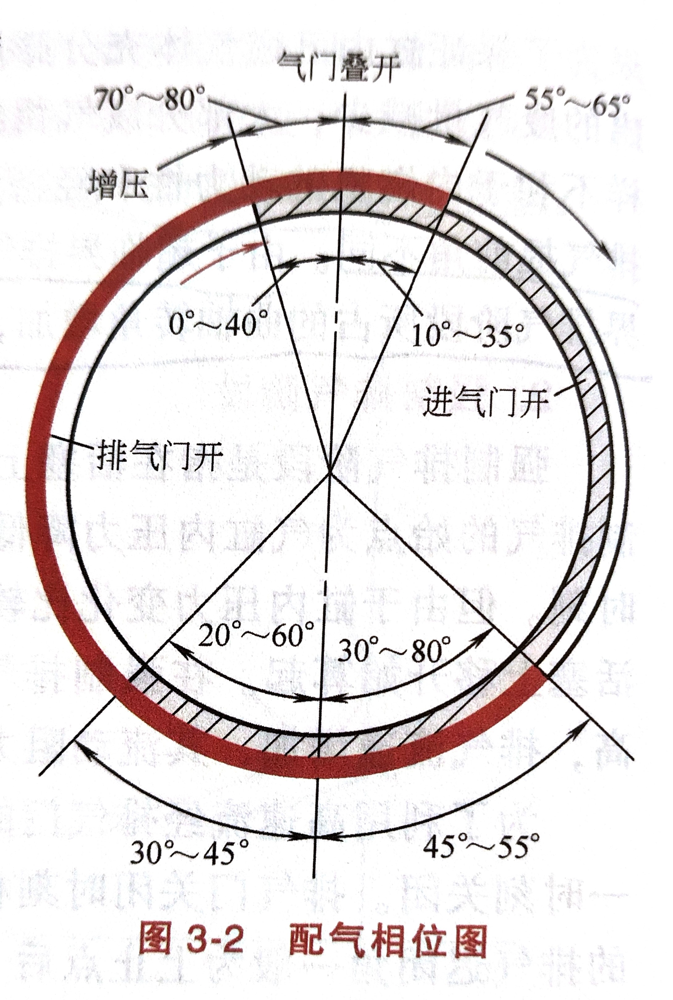
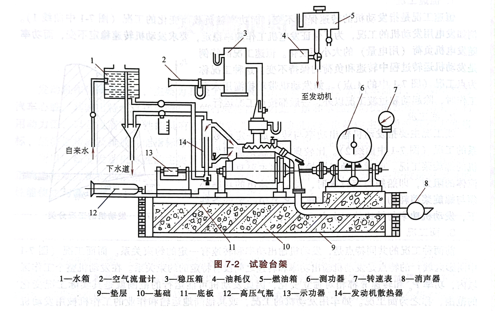

---
category:
   - 车辆工程
   - 发动机原理
tag:
   - 期末复习
   - 学习笔记
   - 车辆工程
   - 发动机原理
date: 2024-1-10
---

# 第二章	内燃机的循环及性能评价指标

## 第五节	机械损失

### 二	内燃机的机械损失

内燃机的机械损失主要来自于其内部相对运动件的摩擦损失、驱动附件的损失及换气过程中的泵气损失三大部分。

|       机械损失分类        |                                              |     占比（$\%$）     |
| :-----------------------: | :------------------------------------------: | :------------------: |
|   摩擦损失：$62\%-75\%$   | 活塞及活塞环 连杆、曲轴轴承 配气机构 | $45-65$ $15-20$ $2-3$  |
| 驱动附件损失：$10\%-20\%$ |    水泵 风扇 机油泵 电气设备     | $2-3$ $6-8$ $1-2$ $1-2$ |
|   泵气损失：$10\%-20\%$   |                                              |       $10-20$        |

1. ==摩擦损失== 摩擦损失主要包括活塞与活塞环相对气缸的摩擦损失、曲轴轴颈和轴承的摩擦损失及配气机构的摩擦损失等。其中，活塞与活塞环相对气缸的滑动面积大、相对速度高、润滑条件差，所以其摩擦损失在整个摩擦损失中占主要部分。曲轴的主轴承、连杆轴承及凸轮轴承等均采用压力润滑，所以摩擦损失相对较小，但随轴承直径的增大及转速的提高，这一部分摩擦损失也将增加。摩擦损失占整个机械损失的$62\%-75\%$。

2. ==驱动附件损失== 为了保证发动机正常工作，除曲柄连杆机构及配气机构以外，还需要冷却系统、润滑系统、燃料供给系统等。这些辅助系统是内燃机连续可靠工作所必不可少的系统，辅助系统的正常工作是发动机可靠运行的重要保证。所以发动机工作时，需要消耗一定的功率去驱动轴助系统中的各工作附件，如冷却风扇、水泵、机油泵、喷油泵、空气压缩机及发电机等。随发动机转速的升高和润滑油黏度的增加，发动机驱动附件所消耗的损失增加。这一部分的损失占整个机械损失的$10\%-20\%$。

3. ==泵气损失== 泵气损失是发动机换气过程中产生的能量损失。为了便于分析将这一部分损失也归入到机械损失之中。由于在进气过程中存在进气流动损失，随着活塞的下移，气缸内产生真空，由此吸入新鲜气体的同时产生进气损失。同理，在排气过程中活塞推出一定压力的废气时，因排气阻力的存在而产生排气损失。泵气损失占整个机械损失的$10\%-20\%$。

# 第三章	内燃机的换气过程

## 第一节	四冲程内燃机的换气过程

- ==排气提前角== 为了尽可能多地排气，同时减小排气行程中气门处的节流损失，以保证排气行程时气门已有足够的开度和流通截面积，一般设置排气提前角。即在膨胀做功过程中，在下止点前某一曲轴转角位置提前开启排气门。
- ==排气迟闭角== 为了利用高速流经排气门的气流惯性尽可能多地排出废气，排气门在排气上止点之后某一时刻关闭。排气门关闭时刻相对上止点所对应的曲轴转角，称为排气迟闭角。
- ==进气提前角== 为了保证进气门有足够大的流通截面积，尽可能使更多的新鲜充量顺利地进入气缸，进气门在上止点前提前某一时刻开启。进气门开启时刻相对上止点所对应的曲轴转角称为进气提前角。
- ==进气迟闭角== 在进气下止点时气门处仍有高速气流流入气缸，为了充分利用气流的惯性而多进气，进气门在活塞下止点后关闭。进气门关闭时刻相对下止点所对应的曲轴转角称为进气迟闭角。

### 三	配气定时及气门叠开现象

由于进排气过程相对上、下止点位置都分别存在着气门开启提前角和关闭迟闭角，因此构成了如（图3-2）所示的四冲程内燃机配气定时图（又称配气相位图）。==根据四冲程内燃机的工作原理，在进气上止点，由于进气门提前开启、排气门迟后关闭而造成进排气门同时开启的现象，这种现象称为气门叠开现象。==进气提前角和排气迟闭角之和称为气门叠开角。在气门叠开期间，进气管、气缸、排气管三者连通。一般通过配气定时的合理设计，保证气门叠开期间通过新鲜气体将气缸内的废气扫出去，这一过程又称为扫气过程。

## 第二节	充气效率及其影响因素

### 一	充气效率

内燃机的充气效率定义为，每循环实际进入气缸的新鲜充量$m_1$与进气状态下充满气缸工作容积的理论充量$m_2$之比，即

$$
\begin{equation}
   \phi_c = \frac{m_1}{m_{sh}} = \frac{V_1}{V_s} \label{eq:充气效率}
\end{equation}
$$

式$\eqref{eq:充气效率}$中，$m_1$、$V_1$分别为实际进入气缸的新鲜充量的质量和体积；$m_{sh}$、$V_s$分别为在进气状态下充满气缸工作容积的新鲜充量的质量和气缸工作容积。

## 第三节	提高充气效率的措施

### 有效利用进气管的动态效应

#### 动态效应

动态效应就是指利用内燃机在间歇地进行进排气过程中产生的进排气管内的压力波，来提高充气效率的方法。进气管的动态效应主要分为惯性效应和波动效应两种。

## 第五节	废气再循环系统

### 一	概述

==废气再循环（EGR）== 是在内燃机换气过程中，将已排出气缸的废气的一部分再次引入进气管与新鲜气体一起进入气缸的过程。

# 第四章	内燃机的燃料与燃烧

## 第二节	内燃机燃料及其使用特性

### 一	柴油

1. **十六烷值**：是评定柴油自燃性好坏的指标。它与柴油机的起动性和工作粗暴有密切的关系。对于自燃性好的燃料，着火延迟期短，在着火延迟期内，气缸中形成的可燃混合气量少，着火后缸内压力升高率低，工作柔和。而且，自燃性好的燃料冷起动性也会有所改善。

2. **馏程**：是评价柴油蒸发性能的主要指标。可用一定体积（如$100mL$）的燃油馏出某一体积分数时的温度范围来表示。常用$50\%$馏出温度和$90\%$馏出温度或$95\%$馏出温度来表示。

   $50\%$馏出温度表示柴油的平均蒸发性。$50\%$馏出温度低，说明柴油中轻馏分含量高，蒸发快，有利于混合气的形成。$50\%$馏出温度主要影响柴油机的暖机性能、加速性和工作稳定性。

   $90\%$出温度和$95\%$馏出温度标志着柴油中难以蒸发的重馏分（重质成分）的含量，直接影响燃料能否及时完全燃烧。如果重馏分过多，在高速柴油机中燃料来不及蒸发，直接影响可燃混合气的形成，导致燃烧过程不及时不完全，易排气冒烟。因此，高速柴油机常使用轻馏分柴油。但是馏分太轻，$50\%$馏出温度也低，大部分轻质馏分容易蒸发，因此会在着火前形成大量的可燃混合气，一旦着火，所形成的可燃混合气同时燃烧，使压力升高率过大，导致柴油机工作粗暴。

3. **黏度**：表示燃料分子间内聚力的大小，表现为抵抗分子间相对运动的能力，表示柴油流动性的好坏，它直接影响柴油机喷射系统的喷雾质量。当其他条件相同时，黏度越大，雾化后油滴的平均直径也越大，使得燃油与空气混合不良，造成柴油机的燃料消耗率增加，排气冒烟。此外，黏度还影响供油系统中喷油器等偶件的润滑性。柴油的黏度常用动力黏度和运动黏度表示。
4. **凝点**：表示柴油失去流动性而开始凝固的温度，主要用于评定柴油的低温流动性。因此，对应不同的环境温度，应采用不同凝点的柴油。

5. **热值**：是指 $1kg$ 燃料完全燃烧所释放的热量，表示燃料所具有的做功能力。热值越大的燃料，其单位燃料完全燃烧所能放出的能量越大。因此，在相同的燃烧条件下，所能转换的机械能越多，做功能力就越强。柴油机燃烧后排出废气时，$H_2O$以水蒸气状态排出，其汽化热不能有效利用，因而柴油的热值采用低热值，即$H_u=42700kJ/kg$。

柴油除了具有上述主要使用性能指标以外，还有与柴油的储、运、使用有关的指标，如闪点、凝点、冷滤点；与柴油机磨损、腐蚀等有关的指标，如机械杂质、水分、灰分、含硫量、酸度、残炭等，具体选用时须兼顾这些性能指标。

# 第五章	汽油混合气的形成和燃烧

## 第一节	汽油机混合气形成及热功转换特点

### 三	空燃比与发动机性能的关系

#### 汽油机各工况对空燃比的要求

|   工况   | 混合气类型 |       空燃比（$\alpha$）       |  过量空气系数（$\phi_a$）   |
| :------: | :--------: | :----------------------------: | :-------------------------: |
|   启动   | 较浓混合气 |  $5.88 \leq \alpha \leq 8.82$  | $0.4 \leq \phi_a \leq 0.6$  |
|   怠速   |            | $8.82 \leq \alpha \leq 11.76$  | $0.6 \leq \phi_a \leq 0.8$  |
| 中小负荷 | 经济混合气 | $15.14 \leq \alpha \leq 16.17$ | $1.03 \leq \phi_a \leq 1.1$ |
|  全负荷  | 功率混合气 | $11.76 \leq \alpha \leq 13.23$ | $0.8 \leq \phi_a \leq 0.9$  |

#### 汽油机加速工况对混合气浓度的要求

- 在急加速时，要求混合气量要突增，并保证浓度不下降，以满足发动机的动力需求。
- 在急加速时，必须采用专门的装置额外供油，加浓混合气，以防止混合气过稀导致发动机动力下降或熄火。
- 在急加速时，应供给较浓的混合气，一般为$α=0.85-0.95$。

## 第二节	汽油机的燃烧过程

### 二	正常燃烧过程

1. **着火延迟阶段**：指火花塞跳火到缸内形成火焰中心的阶段（点火过程）。在此阶段主要形成火焰中心，气缸压力基本保持不变，所以又称为**滞燃期**。但一旦形成火焰中心之后火焰马上迅速向外传播，使气缸压力明显提高。

2. **明显燃烧期（或急燃期）**：指从形成火焰中心至气缸压力达到最高点的阶段。该阶段主要以火焰传播形式烧遍整个燃烧室，所以又称为**火焰传播阶段**。在这一阶段，火焰传播速度主要取决于层流火焰速度、混合气的湍流状态及燃烧室形状。由于均匀可燃混合气火焰传播速度快，压力急剧升高，其变化程度用**压力升高率**来评价，即用单位曲轴转角气缸压力的变化量$\frac{d_p}{d_\varphi}$表示。火焰传播通度越快，明显燃烧期越短，燃烧等容放热程度就越高，发动机动力性、经济性越好，但$\frac{d_p}{d_\varphi}$增加。当$\frac{d_p}{d_\varphi}>0.2-0.4MPa/(^\circ)$时，发动机工作粗暴，振动噪声增加。所以，为了保证汽油机工作柔和，一般将压力升高率限定在$\frac{d_p}{d_\varphi}>0.175-0.25MPa/(^\circ)$范围内。

3. **后燃期**：是指从最高压力点至可燃混合气基本上完全燃烧为止。明显燃烧期内大部分混合气已基本燃烧完毕，而温度较低的气缸壁附近和缝隙处的未燃物，以及火焰面上高温分解的产物等，这些未燃燃料分解物在膨胀过程中再次氧化而形成后燃。在后燃期随活塞加速下移，气缸容积迅速增加，气缸压力和温度下降，同时由于明显燃烧期内产生的燃烧产物的作用，使得燃烧速度降低。

   后燃期内燃烧的量越多，排气温度就越高，表明在明显燃烧期内没有充分燃烧气缸内的混合气，或燃烧系统结构设计不良而造成激冷面或缝隙容积过大。所以，排气温度是评价燃烧过程好坏的一项重要评价指标。应尽量减少后燃期，以降低排气温度。
   
### 三	不正常燃烧

不正常燃烧是指发动机在运转时，由于可燃混合气配比超差（过浓或过稀）、发动机机械原因、点火系统等故障引起的点火能量小、燃烧质量差、不能燃烧或不充分燃烧的一种异常现象。不正常燃烧会导致发动机性能下降、油耗增加、排放恶化、机件损坏等危害。

1. **爆燃**：爆燃是指火花塞点火后，离火花塞最远的末端气体受到火焰前锋面的热辐射和压缩作用，使其压力、温度升高而导致在火焰前锋面到达之前自行燃烧的现象。产生爆燃后的特征是缸内燃烧速度极快，可达每秒数百米，造成很大的压力梯度和温度梯度，从而形成缸内压力冲击波。

2. **表面点火**：凡是不依靠火花塞点火，而是由燃烧室内部炽热表面点燃混合气的现象，称为表面点火。当发动机长期在高负荷下工作时，燃烧室内的排气门、火花塞裙部，以及积炭等沉积物往往可以成为炽热表面。表面点火的主要特点是，炽热表面积比点火表面积大，所以燃烧速度快，而且混合气着火时刻不可控制。根据表面点火发生时刻不同，表面点火又可分为早燃和后燃。

   - **早燃**：是指在火花塞正常点火之前发生表面点火的现象。由于点火提前，点火表面积又大，燃烧速度加快，气缸压力和温度迅速升高，造成发动机工作粗暴。而且压缩负功增大，向气缸传热损失增多，循环热效率降低，输出功率下降。同时，早燃可诱发爆燃，爆燃又会使更多的炽热表面温度升高，促使更剧烈的表面点火，两者互相促进，危害更大。

     与爆燃不同，早燃是正常点火之前由炽热表面点火，所以发生在明显燃烧期的前期，耳然燃烧速度快，压力升高率及最高燃烧压力明显增加，但仍以火焰传播形式燃烧所以没有高频的压力冲击波，对外表现出低频沉闷的声音。

   - **后燃**：是指在火花塞正常点火之后发生表面点火的现象。此时炽热表面温度较低，火花点火以后，在火焰传播过程中，炽热表面受到火焰前锋面的热辐射而被加热，使其温度达到点燃温度以后再点燃其余的混合气，因此相当于两次点火。此时火焰前锋面仍正常传播，促进明显燃烧期中后期的燃烧速度。虽然后燃对发动机影响不大，或在某种程度上可能会提高发动机性能，但是由于燃烧室内部已经形成炽热表面，使得零件的热负荷增加，影响其工作寿命和可靠性。

## 第三节	汽油机燃料喷射量的控制

### 二	质量流量式电控汽油喷射系统的喷射量控制

##### 卡门涡式空气流量计

## 修正系数$F_c$

$$
F_c=f(F_{ET},F_{AD},F_0,F_L,F_H) \label{修正系数}
$$

修正这些参数的目的是为了让电控汽油喷射系统能够根据不同的工况和环境条件，调整喷油量，以保证发动机的动力性能和经济性能。如果不进行修正，喷油量可能会过多或过少，导致发动机的燃烧不完全，增加油耗和排放，甚至损坏发动机。因此，修正这些参数是非常必要的。

1. 温度修正系数$F_{ET}$

   温度修正系数$F_{ET}$主要考虑因温度不同而影响燃料喷雾质量所造成的混合气形成过程的影响。特别是在低温起动时，由于燃料雾化蒸发不良，往往造成实际形成的混合气过稀，从而导致发动机熄火。当发动机温度过高时，汽油在输送管路中易蒸发，从而减小实际喷射量。特别是在高温再起动时很容易产生「气阻」现象，影响高温再起动性。这就是说，发动机在高、低温条件下，按基本喷射脉宽$T_p$，喷射的燃料量均使混合气过稀，所以必须进行加浓修正，否则会造成发动机怠速不稳、高温再起动时易熄火以及游车等现象。

   根据发动机实际运行状态，温度修正主要按以下三个方面分别进行。

   1. 启动后增量修正系数$F'_g$

      当发动机在低温起动时，着火后的数十秒内要进行增量修正。在起动过程中发动机的温度越低，燃料蒸发条件越差。所以，需燃料增量修正量越多，修正时间更长。这是因为，刚起动时进气道、进气门和气缸内壁等表面温度比较低，所以喷油器喷射后在其表面上形成的油膜不易蒸发，引起气缸内混合气变稀，所以需要加浓。$F'_g$是主要考虑进气道、进气门及气缸壁等表面温度低而影响其油膜蒸发量的喷射量增量修正系数。

   2. 怠速暖车增量修正系数$F_I$

      $F_I$主要修正起动后进气门、气缸壁的表面温度及冷却水温刀随时间升高的过程中，进气管及气门处所形成的油膜蒸发作用不足而造成的气缸内混合气偏稀的部分。与$F'_g$相同，$F_I$的修正值也随$T_w$的降低而增加，并与$F'_g$同时进行修正。但是，$F'_g$是在起动后数十秒内修正过程结束，而$F_I$则一直修正到$T_w$达到规定的目标温度为止。

   3. 高温修正系数$F_T$

      高温修正工况是指汽车在大负荷高速行驶后停车$10-30min$，然后再起动的$2-3min$时间内。高温修正的原因是，汽车在高速行驶时，由于迎面风的冷却作用，一般燃油温度低于$50^\circ C$。一旦停车，发动机作为热源而向四周散发热量，此时发动机停机，无冷却风冷却，使得发动机室内的温度升高，燃油温度可高达$80-100^\circ C$。因此，喷油器内的燃料沸腾，产生「气泡」现象。此时，再起动发动机时，即使喷油器的实际喷射脉宽工一定，但因喷射时含气泡，所以实际喷射量明显减少，缸内混合气变稀，无法正常起动，所以需要修正。修正方法是检测$T_w$，并当$T_w \geq 100^\circ C$时进行加浓修正，也可以直接测量燃油温度进行加浓修正。

2. 加减速修正系数$F_{AD}$

   如前所述，当发动机加速运行时，随着节气门开度的增大，进气量增多，进气压力也增加，使得作用在进气管内壁表面附着的油膜表面压力增加，油膜蒸发速度降低，从而造成气缸内混合气变稀。相反，在减速时，随着节气门开度的减小，进气量减少，进气压力也随之降低，使得作用在进气管内壁表面附着的油膜表面压力降低，油膜蒸发速度加快，造成气缸内混合气变浓。此外，油膜附着部分的表面温度越低，油膜蒸发速度越慢，所以也影响气缸内的实际空燃比。因此，当发动机加减速运行时，如果只靠基本喷射脉宽来控制喷射量，就会使空燃比偏离目标值，使发动机工作不稳定，车辆前后方向振动（游车），而且排气中的有害成分也会增加。因此，必须要进行相应的修正。在进行加减速修正时，首先要正确、快速地判断加减速工况。为此，常利用节气门开度信号的变化率来进行工况判断。如由ECU每隔一定时间（如$80ms$）读取节气门开度信号，当在该时间内节气门开度的变化率超过某一规定值时，就判定为加减速状态。

   1. 加速修正系数$F_{AC}$

      加速工况修正系数的确定，主要考虑发动机负荷的变化对油膜蒸发量的影响和冷却水温的交化对油膜蒸发量的影响，即
      $$
      F_{AC} = F_{DL_1}F_{THW_1}
      $$
      式中、$F_{DL_1}$为对应负荷变化量的修正系数，主要修正进气压力（负荷）升高时，油膜蒸发汽化速度降低所造成的汽化不足的部分，负荷可用每转进入气缸的空气量$q_m/n$或节气门度表示；$F_{THW_1}$为对应冷却水温的修正系数，主要修正油膜附着部分的表面温度降低时。

   2. 减速修正系数$F_{DC}$

      与加速修正系数$F_{AC}$相反，当发动机减速时，节气门开度减小，进气压力随进气量的减小而降低，因而油膜表面压力减小，加快了其表面的蒸发速度，造成减速时气缸内的混合气变浓，所以必须进行减量修正。减速时的修正系数也要考虑负荷和冷却水温两个因素的影响，即

3. 氧传感器反馈修正系数$F_0$

   一般汽油机均采用三效催化转化器来同时净化$CO$、$HC$和$NO_x$排放。而三效催化转化器只有在理论空燃比下，才能同时有效地净化$CO$、$HC$和$NO_x$三项有害物的排放。因此，为了有效控制汽油机的排放，需要精确控制理论空燃比。而开环控制不能精确地控制理论空燃比，所以，在排气管中安装氧传感器，测量排气中氧的含量，由此检测实际燃烧过程的空燃比，并对基本喷射脉宽进行反馈修正，实现对理论空燃比的反馈控制（闭环控制）。

4. 学习控制修正系数$F_L$

   学习修正的目的，就是修正由于某种原因（如发动机长期使用使一些零部件磨损等）使反馈控制的空燃比偏离目标值的部分。

5. 大负荷高转速的增量修正系数$F_H$

   一般发动机在部分负荷下运行时，混合气的控制主要考虑在保证排放性能的前提下，尽可能提供经济混合气，以达到最低燃油消耗率的目的。

## 第四节	汽油机燃烧组织方式及燃烧室

### 一	对燃烧室的基本要求

1. 结构

燃烧室结构要紧凑，其紧凑程度常用面容比$\frac{A}{V}$表示，即燃烧室表面积和燃烧室体积之比。由此表征燃烧室内火焰传播距离、散热面积及熄火面积等特征。若$\frac{A}{V}$值小，表明燃烧室散热面积小、火焰传播距离短、熄火面积也小，所以有助于提高热效率和动力性，而且抗爆燃能力强，同时可减小$HC$排放。

2. 充气性能

气缸的充气性能取决于燃烧室形状与进气门、进气道的布置。在燃烧室结构设计时，要考虑应有较大的进气流通面积，如适当增大进气门直径、采用多气门布置等，同时保证进气流线短，转弯少且转弯半径尽可能大，以减小气流的流动损失，提高充气效率。

3. 火花塞的布置

对形状已确定的燃烧室，或在设计燃烧室结构形状时，必须要考虑火花塞的安装位置。布置火花塞时要求尽可能缩短末端气体的火焰传播距离，同时有利于火焰传播速度的控制，而且要使在火花塞安装位置上的气流相对稳定、残余废气的影响小，以保证可靠稳定地点燃混合气，减小循环变动。若空间允许的话，可安装两个火花塞，则燃烧速度更快，抗爆燃能力更强，可以适当提高压缩比，改善热效率，而且循环变动也小。

4. 燃烧室形状与气流运动

燃烧室形状应满足混合气形成及燃烧方式的要求，在气缸内组织适当的气流，在满足速燃要求的同时，通过火焰前锋面积控制燃烧速度和放热速度，在保证发动机动力性和经济性的前提下，减轻发动机的振动噪声，改善排放特性。但是过强的气流会使热损失增加，还有可能吹熄火焰核而失火，造成$HC$排放增加。所以，通过燃烧室形状与进气系统的合理匹配，组织燃烧室内适当的气流，是控制燃烧过程、改善发动机性能的重要环节。同时用什么样的参数指标评价燃烧室内的气流状态，也是分析研究内燃机混合气形成和燃烧过程的重要手段。

## 第五节	汽油机的有害排放物及其控制

1. $CO_2$
2. $H_2O$
3. $HC$
4. $CO$
5. $NO_x$

### 一	汽油机的有害排放物产生机理

#### $NO$

基于Zeldovich理论，$NO$生成的三要素是**燃烧温度**、**氧含量**、**整个燃烧反应时间**。
控制$NO$生成的基本原则是：

1. 减小混合气中$O_2$（或$N_2$）的含量。
2. 尽可能降低燃烧温度。
3. 缩短在高温燃烧带内滞留的时间。

#### $HC$

产生机理及影响因素

1. 缸内壁面淬冷效应==	当燃烧过程中火焰传播至气缸壁面时，温度较低的壁面对火焰迅速冷却，此时如果火焰前锋面的温度降低到混合气自燃点以下时，链式反应中断，火焰熄灭，从而在燃烧室壁面留下一层$0.1-0.3mm$厚的未燃或未完全燃烧的混合气，产生大量的$HC$。

2. ==缝隙效应==	汽油机燃烧室内的缝隙，主要有活塞头部和缸壁之间，气缸盖、气缸垫和气缸体之间，进、排气门和气门座之间，以及火花塞螺纹处和火花塞中心电极周围等处。

   缝隙面容比大，火焰无法传入其中继续燃烧，而且缝隙内的混合气受到两个以上壁面的冷却，故淬冷效应十分强烈而产生大量未燃$HC$。

3. ==积炭和壁面油膜的吸附效应==	气缸壁面上的润滑油膜、沉积在活塞顶部以及燃烧室壁面和进排气门上的多孔性积炭，会吸附未燃混合气及燃料蒸气，这些被吸附的气体在膨胀和排气过程中逐步脱附释放出来，随已燃气体排出气缸而造成排气中的$HC$含量增加。

4. ==不完全燃烧==	如发动机在怠速及高负荷工况下运行时，混合气处于$\phi_a<1$的浓混合气状态，且怠速时残余废气系数较大；而当加速或减速时，混合气会暂时地过浓或过稀，即使此时$\phi_a>1$，油气混合也不均匀。因此在这些条件下，都会造成不完全燃烧而使$HC$排放增加。

5. ==失火==	发动机工作过程中失火现象的发生，是造成大量$HC$（体积分数可达$5\%$）排放的主要原因。因此，对汽油机可靠点燃，防止失火是控制$HC$排放的重要环节。汽油机易发生失火的条件是，混合气形成过程中局部地方混合气过稀或过浓超过着火界限，或点火时刻不当及点火系统出现故障时等。

### 二	影响汽油机排放特性的因素

1. 过量空气系数$\phi_a$
2. 点火提前角
3. 转速
4. 负荷

# 第六章	柴油机混合气的形成和燃烧

## 第二节	柴油机的燃烧过程

1. **滞燃期**或**着火延迟期**:（图$6-1$中$AB$段），是指从喷油器喷油开始的$A$至由于着火燃烧引起气缸压力升高使其开始脱离压缩线的$B$点。在滞燃期，喷油器在点向温度高达$900K$以上的压缩空气喷人燃料后，使喷雾经历破碎、分散、蒸发、汽化等的物理混合过程，和局部可燃混合气先期化学反应使之开始自燃的化学反应过程。

   着火延迟期对柴油机燃烧过程及排放特性的影响很大。着火延迟期越长，则在该时间内喷人的燃料量就越多，所形成的可燃混合气量增加，所以着火时同时燃烧的混合气量越多，压力升高率增大，工作越粗暴，$NO_x$排放量增加。若着火延迟期过短，虽然着火延迟期内形成的可燃混合气量减少，工作柔和，$NO_x$排放量降低,但更多的燃料在后续燃烧过程中喷射，不仅不利于组织燃烧，使得$CO$和$HC$排放量增加，而且热损失也会增加，所以不利于提高经济性。因此，精确控制合适的着火延迟期，对控制柴油机的燃烧过程具有重要的意义。

   影响柴油机着火延迟期$\tau_i$的主要因素有：燃料的十六烷值，压缩终了气缸内的温度和压力，喷雾条件和气缸内的气流特性等。凡是能改善喷雾雾化和蒸发的条件均会使着火延迟期缩短。

2. **速燃期**：是指从气缸压力脱离压缩线的$B$点开始至达到最高气缸压力$P_{xmax}$的$C$点。在这一阶段，主要是在$\tau_i$内形成的可燃混合气同时燃烧，所以又称为**预混合燃烧阶段**。其特点是燃烧等容度高，所以气缸压力和温度急剧升高，最高压力可达$13-18MPa$，一般用平均压力升高率$\frac{\Delta_P}{\Delta_\varphi}[MPa/(^\circ)]$表示气缸内压力的变化程度，即

   $$\frac{\Delta P}{\Delta\varphi}=\frac{P_C-P_B}{\varphi_C-\varphi_B}$$

   式中，$P_C$、$P_B$分别为$C$点和$B$点的压力；$\varphi_C$、$\varphi_B$分别表示为$C$点和$B$点所对应的曲轴转角。

   压力升高率越大，表示预混合燃烧量越多，这虽然有利于提高动力性和经济性，但柴油机工作粗暴，燃烧噪声大，$NO_x$排放量增加。因此，柴油机燃烧过程中压力升高率应限制在一定的范围之内。压力升高率的大小主要取决于在$\tau_i$内所形成的可燃混合气量$m_{\tau_i}$，而$m_{\tau_i}$又与$\tau_i$的长短和在$\tau_i$内喷入的燃料量有关。所以，柴油机燃烧过程控制的关键，就在于以什么样的喷射方式（如高压快速多段喷射），将一定的喷射量以怎样的喷油规律喷入气缸.以控制压力升高率和放热规律。

3. **缓燃期**：是指从最高压力的$C$点至气缸内最高平均温度的$D$点。在这一阶段，一般喷射过程已结束。缓燃期的特点是，在前期喷射的燃料在速燃期内已基本燃烧完毕，后续喷射的燃料是在气缸内空气量减少而燃烧产物不断增多，而且气缸容积逐渐增加的条件下燃烧，所以燃烧速率缓慢，造成边喷射边燃烧的现象。在这一阶段，如果燃烧组织不当，后续喷射的燃料直接喷射到高温缺氧的火焰面上，很容易形成碳烟。因此，缓燃期通过燃烧室内的气流运动和喷雾特性的优化匹配，组织燃料和未燃空气之间的相对扩散运动是非常重要的。从这个意义上又称缓燃期为扩散燃烧阶段，是柴油机燃烧过程中控制节能与碳烟排放的重要环节。影响扩散燃烧的主要因素有燃料与空气之间的渗透能力、燃烧室内的气流特性及强度等，而这些因素又直接影响混合气的形成过程。对于柴油机这种不均匀的混合气形成和燃烧方式，要组织完全燃烧，只能选择较大的空燃比，所以气缸空气利用率低，这是柴油机升功率小于汽油机的主要原因。

4. **补燃期**：是指从最高温度的$D$点至混合气基本燃烧完毕。补燃期的终点很难确定，一般当放热量达到总放热量的$95\%-99\%$时，认为补燃结束。由于柴油机燃烧时间短促，且边喷射边燃烧，混合气又极不均匀，总有部分燃料不能及时燃烧而拖到膨胀过程中再燃烧，因此这种燃烧现象又称为后燃。柴油机在高速、高负荷时，喷射量多，活塞平均速度快，所以后燃比较严重。补燃期的主要特点是，气缸容积不断增加，气缸压力不断下降，燃料在较低膨胀比下燃烧放热，所放出的热量不能有效利用，排温升高，散热损失和排气损失增加，热效率降低。因此，要尽可能减少后燃。

# 第七章	发动机的特性

发动机特性是指发动机在不同工况下的性能参数，如转速、转矩、功率、油耗等。不同类型的发动机有不同的特性曲线，反映了发动机的动力、经济性和可靠性。一般来说，发动机的特性可以分为负荷特性、速度特性和外特性。

## 第一节	概述

### 二	发动机的试验台架

# 名词解释

示功图是指反映发动机或压缩机在一个工作循环中气缸内容积和压力的变化关系的图形。示功图中曲线所围成的面积表示发动机或压缩机对气体所做的功。示功图可以用来分析发动机或压缩机的性能和工作状况。

